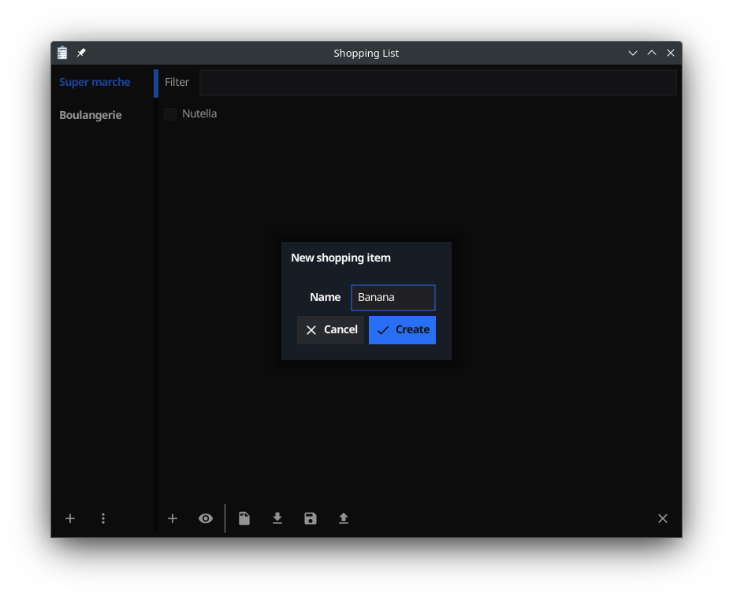

  
  

# Shopping
A Fyne application using BoltDB to store shopping lists used as support material article in GNU Linux Magazine France.

This application support all OS Fyne support and allow sharing shopping list between devices and user using the wormhole protocol.

Download latest binary here: https://geoffrey-artefacts.fynelabs.com/github/Bluebugs/Bluebugs/shopping/latest/index.html

# Screenshot

